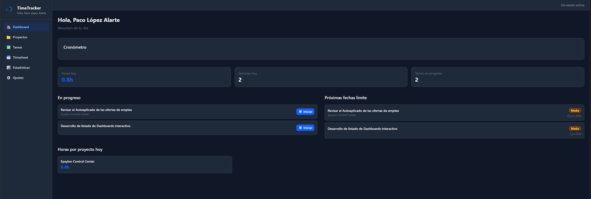
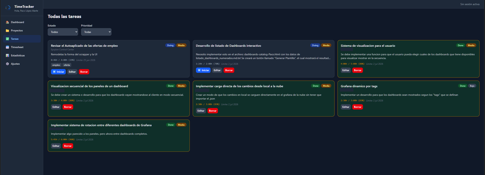
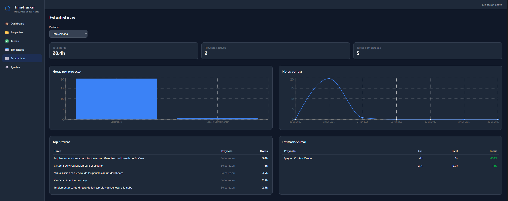

<p align="center">
  
</p>

# TimeTracker

Gestor de tiempo dedicado a tareas y sprints en proyectos. Aplicación web (React + Vite) con base de datos en Supabase, sincronización en tiempo real y sistema de usuarios con roles.

**Producción:** [https://timetracker.pacoal.dev](https://timetracker.pacoal.dev)

## Funcionalidades

- **Autenticación y roles:** Login con email y contraseña. Roles de Administrador y Colaborador.
  - **Administradores:** Acceso total. Creación, edición y borrado de tareas, proyectos y sesiones manuales.
  - **Colaboradores:** Cronómetro en vivo y estados de tareas (kanban). La edición manual de tiempo requiere PIN maestro.
- **Gestión de proyectos y tareas:** Lista y tablero Kanban.
- **Cronómetro:** Inicio, pausa y reanudación con sincronización instantánea entre dispositivos.
- **Timesheet:** Vistas diaria y semanal.
- **Estadísticas y dashboard:** Gráficos y resumen de productividad.
- **Exportación:** PDF y CSV.
- **Modo oscuro:** Configurable en Ajustes.

## Requisitos

- Node.js 18+
- npm
- Cuenta de Supabase (Free Tier)
- Cuenta de Vercel (Hobby) para el despliegue en producción

## Capturas de pantalla





## Instalación local

1. Clona el repositorio e instala dependencias:

```bash
git clone https://github.com/Pacoaldev/Timetracker.git
cd Timetracker
npm install
```

2. Variables de entorno — copia `.env.example` a `.env.local`:

```bash
cp .env.example .env.local
```

Rellena en `.env.local` (Supabase → **Project Settings** → **API**):

```
VITE_SUPABASE_URL=https://tu-proyecto.supabase.co
VITE_SUPABASE_ANON_KEY=tu-anon-key-o-publishable-key
```

3. PIN maestro (edición manual de tiempo) — copia el ejemplo:

```bash
cp src/utils/pin.config.example.js src/utils/pin.config.js
```

Genera el hash SHA-256 de tu PIN:

```bash
node -e "const c=require('crypto'); console.log(c.createHash('sha256').update('TU_PIN').digest('hex'))"
```

Pega el hash en `src/utils/pin.config.js`. Este archivo está en `.gitignore` y **no se sube al repositorio**.

4. Esquema de base de datos — en Supabase, **SQL Editor**, ejecuta el script del proyecto. Si hace falta renombrar columnas a camelCase:

```sql
ALTER TABLE projects RENAME COLUMN fechainicio TO "fechaInicio";
ALTER TABLE projects RENAME COLUMN fechaentrega TO "fechaEntrega";
ALTER TABLE projects RENAME COLUMN presupuestoestimado TO "presupuestoEstimado";
ALTER TABLE tasks RENAME COLUMN proyectoid TO "proyectoId";
ALTER TABLE tasks RENAME COLUMN estimacionhoras TO "estimacionHoras";
ALTER TABLE tasks RENAME COLUMN horasreales TO "horasReales";
ALTER TABLE tasks RENAME COLUMN fechalimite TO "fechaLimite";
ALTER TABLE sessions RENAME COLUMN tareaid TO "tareaId";
ALTER TABLE sessions RENAME COLUMN duracionminutos TO "duracionMinutos";
ALTER TABLE sessions RENAME COLUMN pausasminutos TO "pausasMinutos";
ALTER TABLE activities RENAME COLUMN entidadid TO "entidadId";
```

## Uso en local

```bash
# Windows (atajo incluido)
scripts\launch-timetracker.bat

# macOS / Linux
npm run dev
```

La app abre en [http://localhost:5173](http://localhost:5173).

## Login y usuarios

1. En `/login`, **Registrarse** con email y contraseña.
2. La cuenta se crea como `collaborator` por defecto.
3. Para ser **administrador:** Supabase → **Table Editor** → `profiles` → cambia `role` a `admin`.
4. Invita a compañeros con la misma URL de producción; se registran igual.

### Recuperar contraseña

- En login: **¿Olvidaste la contraseña?** (envía email vía Supabase).
- El enlace redirige a `/reset-password` para elegir contraseña nueva.
- El enlace de recuperación **inicia sesión automáticamente** (comportamiento normal de Supabase); la pantalla de reset pide la nueva contraseña.

### Configuración obligatoria de Auth en Supabase

Sin esto, los emails apuntan a `localhost` y el login en producción falla.

Supabase → **Authentication** → **URL Configuration**:

| Campo | Valor |
|-------|--------|
| **Site URL** | `https://timetracker.pacoal.dev` |
| **Redirect URLs** | `https://timetracker.pacoal.dev/**` |
| | `http://localhost:5173/**` |

Recomendado para uso personal: **Authentication** → **Providers** → **Email** → desactivar **Confirm email** si no quieres confirmación por correo.

### Límite de emails (`email rate limit exceeded`)

El plan gratuito de Supabase limita los emails de auth (recuperación, confirmación). Si ves ese error:

- Espera ~1 hora antes de volver a pedir recuperación.
- O cambia la contraseña manualmente: **Authentication** → **Users** → menú **⋯** → reset / confirm user.

## Despliegue en Vercel

La app es una SPA estática; los datos viven en Supabase.

### 1. Conectar repositorio

- [vercel.com](https://vercel.com) → **Add New Project** → `Pacoaldev/Timetracker`
- **Framework Preset:** Vite
- **Build Command:** `npm run build`
- **Output Directory:** `dist`

### 2. Variables de entorno en Vercel

Añade (o importa tu `.env.local`):

```
VITE_SUPABASE_URL=...
VITE_SUPABASE_ANON_KEY=...
```

### 3. PIN en producción

`pin.config.js` no está en Git. Opciones:

- Crear el archivo en el entorno de build antes de `npm run build`, o
- Mantener una copia local y asegurarte de que exista donde Vercel construye el proyecto.

Si el build falla por `pin.config.js`, copia `pin.config.example.js` → `pin.config.js` con tu hash en el servidor/CI.

### 4. Dominio personalizado

**Producción:** `https://timetracker.pacoal.dev`

En Vercel → **Settings** → **Domains** → añade `timetracker.pacoal.dev`.

En **DigitalOcean** (DNS de `pacoal.dev`):

| Tipo | Hostname | Valor |
|------|----------|--------|
| CNAME | `timetracker` | El valor que indique Vercel (ej. `xxxx.vercel-dns-017.com`) |
| TTL | | `300` recomendado durante la configuración |

DigitalOcean muestra `timetracker.pacoal.dev` como vista previa al escribir solo `timetracker` en Hostname; es correcto.

**Nota:** `pacoal.dev` (raíz) puede seguir apuntando al portfolio en DigitalOcean. TimeTracker usa solo el subdominio.

La propagación DNS puede tardar unos minutos. Comprueba con:

```bash
nslookup timetracker.pacoal.dev 8.8.8.8
```

## Uso en móvil (Android / iOS)

1. Abre [https://timetracker.pacoal.dev](https://timetracker.pacoal.dev) en Chrome.
2. Inicia sesión con tu cuenta.
3. Menú → **Añadir a pantalla de inicio**.

PC y móvil comparten los mismos datos vía Supabase (misma URL, mismo proyecto Supabase). Los ajustes de UI (modo oscuro, nombre en sidebar) se guardan por dispositivo en `localStorage`.

## Build local de producción

```bash
npm run build
npm run preview
```

El artefacto queda en `dist/`.

## Estructura de URLs

| Entorno | URL |
|---------|-----|
| Producción | `https://timetracker.pacoal.dev` |
| Local | `http://localhost:5173` |
| Login | `/login` |
| Recuperar contraseña | `/reset-password` |

## Solución de problemas

| Problema | Solución |
|----------|----------|
| Email de recuperación va a `localhost` | Revisa **Site URL** y **Redirect URLs** en Supabase |
| `email rate limit exceeded` | Espera o resetea contraseña en Supabase → Users |
| Dominio en rojo en Vercel | Comprueba CNAME en DigitalOcean; pulsa Refresh; espera propagación |
| Login no entra | Confirma usuario en Supabase o desactiva confirmación por email |
| Build en Vercel falla | Revisa env vars y que exista `pin.config.js` en el build |
| "Sin sesión activa" en la cabecera | No hay cronómetro activo; no es un error de login |
| "Hola, Usuario" en sidebar | Nombre en **Ajustes** (`settings.userName`), no el email de auth |

## Tecnologías

React, Vite, Tailwind CSS, Zustand, Supabase (PostgreSQL, Auth, Realtime), react-router-dom, @dnd-kit, recharts, jsPDF.

## Licencia

Uso personal.
